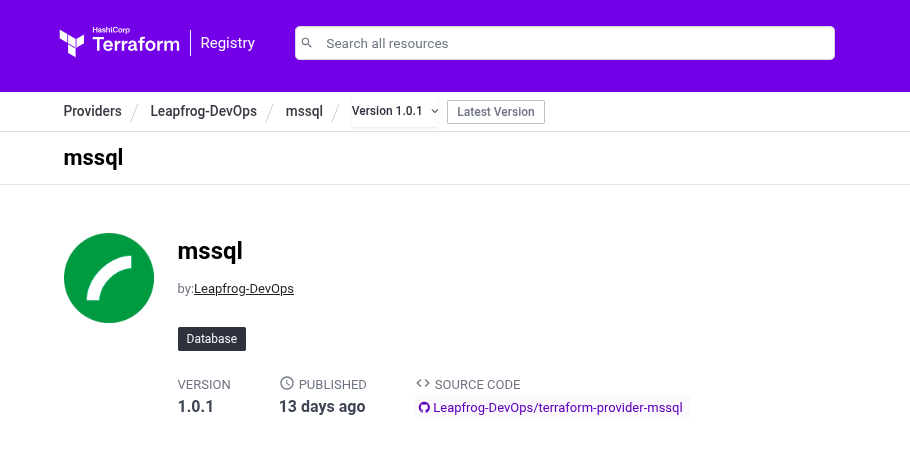

# Terraform Provider for Microsoft SQL Server (MSSSQL)



A Terraform provider for managing Microsoft SQL Server resources including databases, logins, users, roles, and role assignments.

## Features
- **Database Management**: Create and manage SQL Server databases
- **User Authentication**: Manage SQL Server logins and database users
- **Role Management**: Create roles and assign users to roles
- **Data Sources**: Query SQL Server information
- **Complete CRUD Operations**: Full lifecycle management for all resources

## Resources

- `mssql_database` - Manage SQL Server databases
- `mssql_login` - Manage SQL Server logins (server-level authentication)
- `mssql_user` - Manage database users (database-level access)
- `mssql_role` - Manage database roles
- `mssql_role_assignment` - Assign users to roles


## Requirements 

- [Terraform](https://developer.hashicorp.com/terraform/downloads) >= 1.0
- [Go](https://golang.org/doc/install) >= 1.23

## Building The Provider

1. Clone the repository
1. Enter the repository directory
1. Build the provider using the Go `install` command:

```shell
go install
```

## Adding Dependencies

This provider uses [Go modules](https://github.com/golang/go/wiki/Modules).
Please see the Go documentation for the most up to date information about using Go modules.

To add a new dependency `github.com/author/dependency` to your Terraform provider:

```shell
go get github.com/author/dependency
go mod tidy
```

Then commit the changes to `go.mod` and `go.sum`.

## Using the provider

1. To use local provider (binary), first .terraformrc file is required which can be made using makefile.
```
$ make -f Makefile 
```
2. Use the following terraform configuration
```hcl
terraform {
  required_providers {
    mssql = {
      source = "hashicorp.com/terrafarmers/mssql"
    }
  }
}
```
3. To use the provider from terraform registry. Use the following
```
terraform {
  required_providers {
    mssql = {
      source = "Leapfrog-DevOps/mssql"
      version = "1.0.0"
    }
  }
}

```
4. To connect to RDS instance
```
provider "mssql" {
  host = "link_to_rds_instance" 
  user= "sa"
  password = "YourStrong!Passw0rd"
}
```
5. To create a LOGIN resource
```
resource "mssql_login" "login_test123" {
  name             = "testuser1123"
  password         = "SuperSecretPassword123!"
  type             = "sql"    # options: "sql" or "windows"
}
```
6. To create a database
```
resource "mssql_database" "database_test" {
  name = "testdb"
}
```
7. To create a user 
```
resource "mssql_user" "userexample" {
  name     = "example_user"
  database = mssql_database.database_test.name
  login    = mssql_login.login_test123.name
}
```
6. To create a database role
```
resource "mssql_role" "roletest"{
  name = "app_user1234"
  database = mssql_database.database_test.name
}
```
7. To assign a role to a user
```
resource "mssql_role_assignment" "assignmenttest"{

  member_name=mssql_user.userexample.name
  database=mssql_database.database_test.name
  role_name=mssql_role.roletest.name
}
```
## Developing the Provider

This repository is built on the [Terraform Plugin Framework](https://github.com/hashicorp/terraform-plugin-framework). 

- A resource and a data source (`internal/provider/`),
- Examples (`examples/`) and generated documentation (`docs/`),
- Miscellaneous meta files.


## Running Tests
In order to test the provider, you can simple run `make test`. Make sure you have all the requirements installed.
```
$ make test
```

